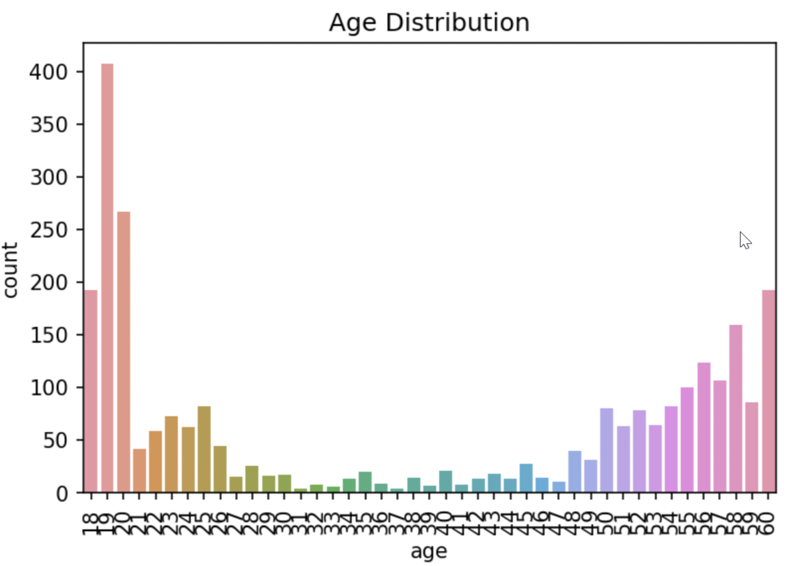

# 랩업 리포트

# Part 1. [팀] 프로젝트 Wrap Up

## 1-1. 프로젝트 개요

- 프로젝트 주제
    - 마스크 이미지 분류 ( 성별/ 나이/ 마스크 )
- 프로젝트 개요(프로젝트 구현 내용, 컨셉, 교육 내용과의 관련성 등)
    - **EfficientNet**을 활용한 이미지 분류 대회
- 활용 장비 및 재료(개발 환경, 협업 tool 등)
    - GPU : V100
    - 개발 Tool : Visual Studio Code, Jupyter Lab
    - 협업 Tool : Git, Slack, Notion
- 프로젝트 구조 및 사용 데이터셋의 구조도(연관도)
    - pytorch-template 기반의 프로젝트 [[GitHub 링크](https://github.com/boostcampaitech4cv1/level1_imageclassification_cv-level1-cv-01)]
    
    ```
    project/
    │
    ├── train.py - 모델 학습 코드
    ├── test.py - submission.csv 생성 코드
    │
    ├── configs/ - 학습/추론 설정 모음
    │
    ├── data_loader/ - 데이터 셋 관련 코드
    │
    ├── model/ - 모델 관련 코드
    │
    └── saved/ - 학습 로그 저장 디렉토리
    ```
    
    - 데이터셋 설명
        - 전체 사람 명 수 : 4,500
        - 한 사람당 사진의 개수: 7 [마스크 착용 5장, 이상하게 착용 1장, 미착용 1장]
        - 이미지 크기: (384, 512)
        - 60% 의 사람이 학습 데이터로 사용된다.
    **Class Description**


    ```
    data/
    │
    ├── train/ - 학습 데이터 디렉토리
    │   ├── train.csv - meta 데이터
    │   └── images/
    │       └── [인물 ID]/ - 이미지 파일 디렉토리
    │
    └── eval/ - 평가 데이터 디렉토리
    ```
    
- 기대 효과
    - 위생이 민감한 병원이나, 펜데믹 상황에 건물 출입 시스템에 사용하거나, 마스크 착용 여부를 모니터링할 수 있다.

## 1-2. 프로젝트 팀 구성 및 역할 (팀원 별로 주도적으로 참여한 부분을 중심으로 간략히 작성)

**이강희(팀장)**: 팀의 기본적인 목표 설정 및 협업 리딩, MultiHead 실험

**박용민(팀원)**: CutMix 실험, Loss 실험, 모델 설계 및 실험, 모델 튜닝

**최휘준(팀원)**: mmcls 조사, ThreeModel 실험, Data Augmentation

**정상헌(팀원)**: ensemble 실험, Class Imbalance 해결, Fine Tuning 실험

**함수민(팀원)**: mmcls 조사, data augmentation 실험, Focal Loss 구현 및 실험

## 1-3. 프로젝트 수행 절차 및 방법

- 프로젝트의 사전 기획과 프로젝트 수행 및 완료 과정으로 나누어서 작성합니다.

| 10/24 (월) | 10/25 (화) | 10/26 (수) | 10/27 (목) | 10/28 (금) |
| --- | --- | --- | --- | --- |
| 서버 세팅 | 베이스라인 작성 | 데이터 분석 | augmentation | augmentation |

| 10/31 (월) | 11/1 (화) | 11/2 (수) | 11/3 (목) | 11/4 (금) |
| --- | --- | --- | --- | --- |
| 오버피팅, Imbalance | 오버피팅, Imbalance | 하이퍼파라미터 튜닝 | 앙상블 | wrap-up report |

**실험 결과를 일부 정리한 페이지**

## 1-4. 프로젝트 수행 결과

- 프로젝트 결과물이 도출된 과정을 세부적으로 기록합니다.
- 활용된 기술(구현 방법), 핵심 기능, 검증 결과 등을 상세히 기재합니다.
- 프로젝트의 과정이 잘 드러날 수 있도록 데이터 전처리 과정부터 활용까지 전체적인
프로세스를 확인할 수 있도록 단계별로 작성하시기 바랍니다. (요약적, 유기적, 논리적으로
작성할 수 있도록 유의해주세요!)
    - 탐색적 분석 및 전처리 (학습데이터 소개)
        
        ### **데이터** 분석
        
        
        
        나이별 데이터 분포도
        
        
        
        나이 데이터 분포도
        
        Age 라벨링
        
        - 0≤ Age <30 → 0
        - 30≤ Age < 60 → 1
        - 60 == Age → 2
        
        
        
        성별, 나이별 데이터 분포도
        
        
        
        성별 데이터 분포도
        
        Gender 라벨링
        
        - ‘male’ → 0
        - ‘female’ → 1
        
        ### 데이터 전처리
        
        
        
        60세 augmentation 후 class별 train dataset 분포도
        
        60세 데이터(label : 2)가  비교적 적어서 60세 데이터만 5배 Augmentation(Horizontal Flip, Rotate를 적당히 조합)을 시켜서 실험했다.
        
        성능이 개선되지 않고, 60대 데이터에 과적합이 일어나서 Augmentation을 2배(Rotate left, right)만 적용시켰더니 약간의 개선이 있었다.
        
        60세 데이터가 부족한게 아니라, 30~59세 데이터 개수와 60세 데이터 개수를 비교하니 당연히 60세 데이터 개수 비율이 적을 수 밖에 없는 것 같다.
        
    - 모델 선정 및 분석
        
        ### EfficientNet-B4
        
        - 모델 선정 이유 :  한번도 사용해보지 못했고, 성능 또한 좋은 모델을 사용해보고자 했기 때문에 EfficientNet계열의 모델을 선정했다.
        - 모델 분석 및 평가 : 가장 큰 모델이 성능도 좋을 것이라는 판단 하에 b7부터 시작했으나, 모델이 데이터에 완전히 fit하는 경우가 발생하였다. 이를 막고자 b0부터 하나하나 실험을 통해 EfficientNet계열의 모델 중, b4모델로 선택하게 되었다.
    
    - 시연 결과
        - 모델 성능
            - Public (14등)
                - F1-Score : 0.7337
                - Accuracy : 78.2857
            - Private (11등)
                - F1-Score : 0.7290
                - Accuracy : 77.4603

## 1-5. 자체 평가 의견

- 프로젝트 결과물에 대한 프로젝트 의도와의 부합 정도 및 실무활용 가능 정도, 계획 대비 달성도, 완성도 등 자체적인 평가 의견과 느낀점을 포함합니다.
- 팀 차원에서 잘한 부분과 아쉬운 점을 작성합니다. (팀 별 공통 의견 중심으로 작성하며,
2~3장 분량을 고려하여 개인적인 의견은 개인 회고 부분에서 작성할 수 있도록 합니다.)
    - 잘한 점들
        - PyTorch Project 템플릿을 사용해서 능률을 높일 수 있었다.
        - 갖고 있는 데이터에만 최적화 하는 것이 아닌 일반화 성능을 위해 노력했기 때문에 private 결과에서는 등수가 좀 올라간 것 같다.
        - 처음부터 모든 팀원의 방향성이 잘 맞아서 화기애애하게 프로젝트가 진행된 것 같다.
        - 모두 아침부터 밤 늦게까지 소통이 잘 되었고, 이를 통해 많은 것을 얻어간 것 같다.
    - 시도 했으나 잘 되지 않았던 것들
        - CutMix의 코드 작업이 상당히 오래 걸렸는데 생각보다 성능 향상이 크지 않았다.
        - Augmentation에 대한 실험이 데이터의 통계적 분포를 건드리는 것이기 때문에 한두가지만 바꿔서 여러 실험을 돌려도 정확한 성능 분석이 어려워서 제대로 고르지 못했다.
        - 마지막에 task를 3개로 나누어서 앙상블과 비슷한 방법으로 따로 classification과 regression을 진행했는데 시간이 부족해서 많이 실험해보지 못했다.
        - 마찬가지로 시간이 부족해서 optimizer, loss function 등 제대로 시도해보지 못한 여러 실험들이 있었는데 제대로 진행하지 못한 실험이 많았다.
    - 아쉬웠던 점들
        - 처음에는 체계적인 실험을 위해 여러 과정과 가설을 정의하고 시작 했지만, 갈 수록 체계가 조금씩 무너졌고 실험 결과가 잘 종합되지 않았다.
        - 어떤 실험을 정의할 때, 정확한 근거 없이 정의해서 성능이 올라간 후에도 왜 올라 갔는지 깨닫는데 시간이 걸렸다.
        - 개인별로 git branch를 파서, 깃을 제대로 활용하지 못했다.
        - 각자 역할을 정하고 시작하지 않아서 약간은 흐지부지 된 경향이 있는 것 같다.
    - 프로젝트를 통해 배운 점 또는 시사점
        - 대회를 위해 어떤 순서로 과정을 이어 나가야 하는지 알게 되었다.
        - 협업을 할 때 전체적인 방향성을 맞추고 시작해야 중간에 잡음이 생기지 않는다는 것을 알게 되었다.
        - 소통의 중요성을 알게 되었다.
        - Class Imbalance가 DL Task에서 얼마나 중요하고 어떤 해결 방법들이 있는지 알게 되었다. 또, 왜 Accuracy 만이 아닌 F1-score를 metric으로 사용하는지도 알게 되었다.
        

# Part 2. [개인] 개인 회고    

### 박용민_T4087
  - **이번 프로젝트에서 나의 목표는 무엇이었는가?**
      - 전체적인 팀의 목표 : 우리 팀의 목표는 공부와 이론 학습에 초점을 두었다.
          - 공동 학습 측면 : 다 같이 최종 목표를 향해 학습을 할 수 있도록 함께 어렵지 않은 짧은 목표들을 잡았다.
      - 나의 목표 : 나 또한 학습에 초점을 두고 공부를 위주로 목표를 잡았다.
          - 개인 학습 측면 : 학습을 위해 구글을 적극 활용하고, 새롭게 알게 된 이론들은 정리해두려고 노력했다.
  - **나는 어떤 방식으로 모델을 개선했는가?**
      - 구현해보지 않았던 CutMix를 구현하고, 우리 구현 코드에 맞게 수정했다.
      - 알고 있던 여러 Loss와 방법론을 팀원들에게 제시하고 공유했다.
      - 여러 실험들을 체계적으로 실천하려고 노력했다.
  - **전과 비교해서, 내가 새롭게 시도한 변화는 무엇이고, 어떤 효과가 있었는가?**
      - 모델을 그저 긁어와서 사용하거나 라이브러리를 통해 선언하는 것이 아닌 여러 방향에서 바라보며 다양한 기법을 통해 바꿔보려고 노력했다. → 어느 정도 성능 향상은 있었으나 높은 향상이 없었을 뿐더러 어떤 측면의 한계로 성능 향상이 별로 없었는지, 어떤 측면에서 장점으로 작용해 성능이 향상 되었는지 정확하고 논리적인 분석이 잘 되지 않았다.
  - **마주한 한계는 무엇이며, 아쉬웠던 점은 무엇인가?**
      - 가장 아쉬웠던 점은 위에서 언급한 정확하고 논리적인 분석이 잘 되지 않았다는 것이다. 멘토링에서 멘토님 또한 지적해주셨던 부분이다.
      - 추가로 초반에 EDA부터 시작하지 않았다는 것이 상당히 아쉬웠다. 미리 데이터를 분석하고 시작했다면 시간을 대폭 줄일 수 있었을 것 같고, 어떤 부분을 고쳐야 성능 향상이 일어날 것인지 더 일찍 깨달았을 것 같다.
      - 체계적인 실험을 위해 이것 저것 정의하고 가설을 세웠지만, 결국 실험을 진행하면서 개인적으로 돌리게 되는 실험이 많아졌고 이로 인해 체계가 조금은 무너진 것 같다. → 실험 결과 종합이 잘 되지 않았다.
      - 초기에 방향성을 높은 점수가 아닌 공부에 초점을 두고 시작했지만 막상 대회가 시작되니 눈 앞에 보이는 리더보드가 생각 이상으로 신경이 쓰여서 공부에 잘 집중이 되지 않은 것 같다.
  - **한계/교훈을 바탕으로 다음 P-Stage에서 스스로 새롭게 시도해볼 것은 무엇일까?**
      - 멘토링에서 멘토님께서 지적해주셨던 부분인 논리적이고 근거가 있는 실험 계획 수립과 가설 수립을 탄탄하게 가져가야 더욱 질 높은 대회 참여가 가능할 것 같다. → 계속해서 서로 질문하고 이게 왜 필요한지, 어떤 부분에서 좋을 것 같은지 논리적인 토론이 필요할 것 같다.
      - 초기에 방향성을 정했다면 그 방향성을 잃지 않고 끝까지 가거나, 중간에 바뀐다면 팀원들과 다시 한번 상의해봐야 할 것 같다.
      - 실험에는 체계가 매우 중요하다고 생각한다. P-stage에서는 새로운 팀원들과 체계가 무너졌던 경험을 바탕으로 더 탄탄하고 체계적인 실험을 진행해서 결과를 잘 종합해야 할 것 같다.
      - 다음 대회가 시작되거나 어떤 Task를 수행할 때, EDA부터 진행하고 이 데이터를 가장 잘 설명할 수 있는 모델을 만들기 위해서는 어떤 방법을 써야할 지 정리를 하고 시작해야 할 것 같다.